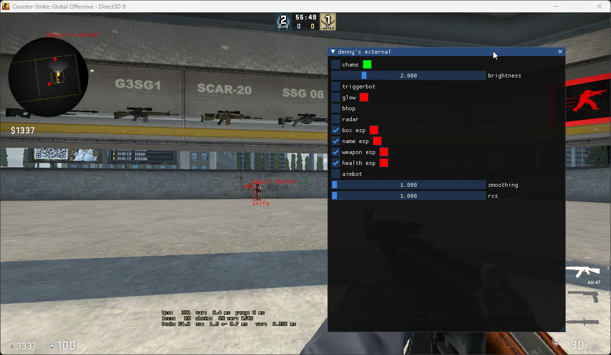

# csgo-external

A CS:GO external cheat written for Windows

Cheat features:
Chams (clRender)
Triggerbot
Glow
Bhop
Radar (engine radar)

Other cool things:
ImGui menu
Pattern scanning
Netvar manager
Optimized code (I think)

Credits:
All code I've stolen has been creditted in the source
[ocornut for ImGui](https://github.com/ocornut/imgui)
