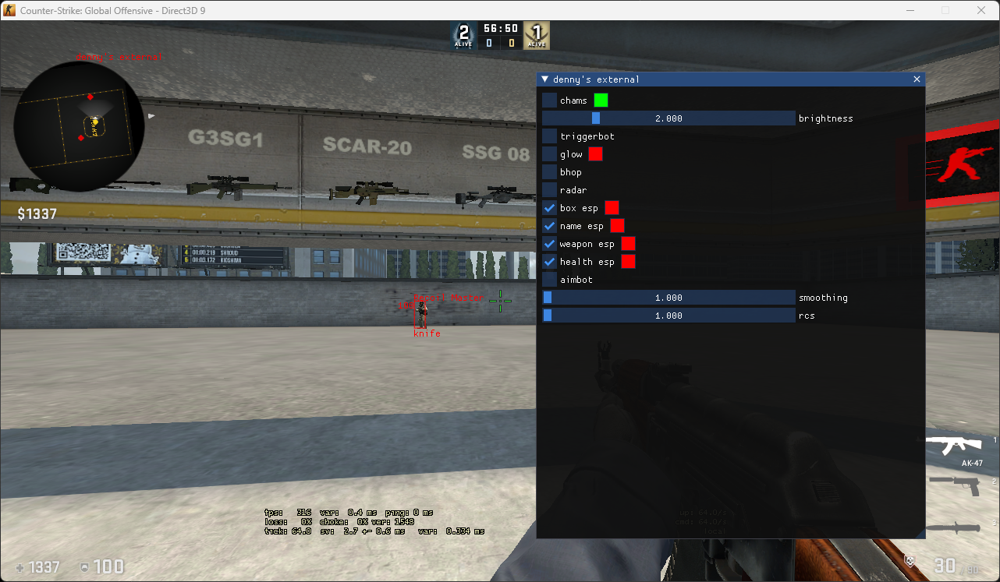

# csgo-external

A CS:GO external cheat written for Windows in C++

A lot of new things added in the newest update:  
Aimbot, ESP (overlay), a lot of things fixed

Cheat works in both borderless and windowed mode  

Cheat features:  
Chams (clrRender)  
Triggerbot  
Glow  
Bhop  
Radar (engine radar)

Other cool things:  
ImGui menu  
Pattern scanning  
Netvar manager  
Optimized code (I think)  
Multithreading

Credits:  
All code I've stolen has been credited in the source  
[ocornut for ImGui](https://github.com/ocornut/imgui)

Dependencies:  
[DirectX9 SDK](https://www.microsoft.com/en-us/download/details.aspx?id=6812)
